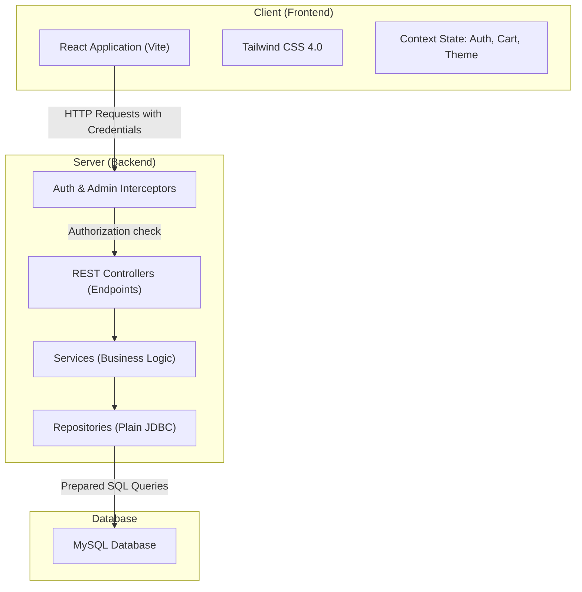
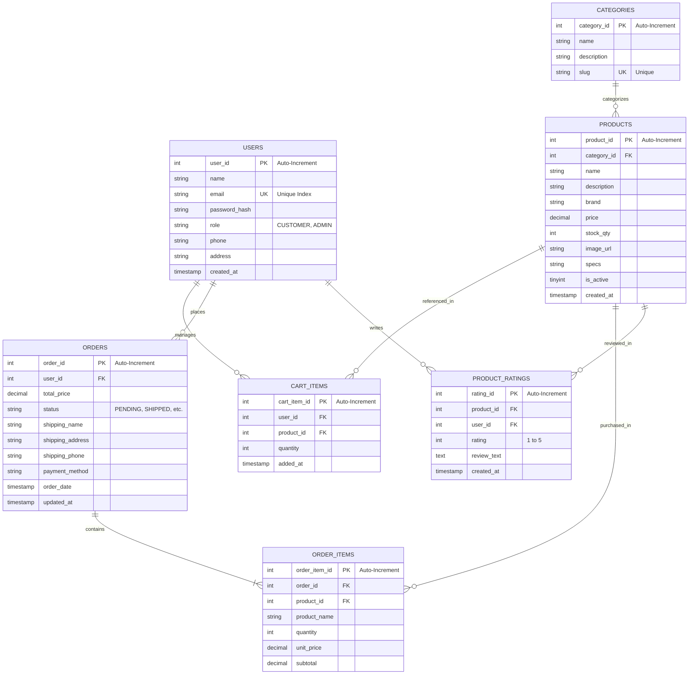

# TechStore - Inventory and Sales Management System Report

TechStore is a modern web application designed for a computer store to manage product inventory, sales, customer accounts, and order processing. The system features a custom-built, lightweight architecture utilizing a Spring Boot backend and a React (Vite + Tailwind CSS v4) frontend.

---

## 1. System Architecture

The project is structured with a clean separation of concerns between the frontend client and the backend API server. Instead of using a heavy framework like Spring Security or Hibernate (ORM), the application utilizes a custom session-based interceptor architecture and raw JDBC query patterns to optimize performance and keep the logic explicit and maintainable.

### Architectural Diagram



---

## 2. Technology Stack Breakdown

| Layer | Component / Technology | Version / Detail | Purpose |
| :--- | :--- | :--- | :--- |
| **Backend** | Spring Boot | 3.2.4 | REST API & web servlet framework |
| | Java (JDK) | 17 | Core language runtime |
| | Spring JDBC Starter | Standard Spring Boot | Plain JDBC database connectivity (HikariCP pool) |
| | MySQL Connector | 8.x | Database driver |
| | jBCrypt | 0.4 | Secure password hashing |
| | Jakarta Servlet API | Standard | Underlying servlet and session handling |
| **Frontend** | React | 19.x | Component-based UI library |
| | Vite | 8.x | Fast build tool and dev server |
| | Tailwind CSS | 4.3.0 | Modern utility-first styling |
| | React Router DOM | 7.17.0 | Client-side routing and page route guarding |
| | Lucide React | 1.17.0 | Modern interface iconography |
| **Database** | MySQL | 8.0+ | Relational storage for transactional data |

---

## 3. Database Schema & ERD

The database uses a standard normalized relational structure. The schema is initialized in the backend resources via [schema.sql](file:///c:/Users/Muhammad%20Hussnain/OneDrive/Documents/2nd%20Semester/Projects/project2/techstore/src/main/resources/schema.sql).

### Entity Relationship Diagram (ERD)



---

## 4. Key Components Map

### Backend (Spring Boot REST Server)

The backend code is organized into clean functional packages under [src/main/java/com/techstore/](file:///c:/Users/Muhammad%20Hussnain/OneDrive/Documents/2nd%20Semester/Projects/project2/techstore/src/main/java/com/techstore/):

*   **`config`**
    *   [WebConfig.java](file:///c:/Users/Muhammad%20Hussnain/OneDrive/Documents/2nd%20Semester/Projects/project2/techstore/src/main/java/com/techstore/config/WebConfig.java): Registers the security interceptors, sets up CORS permissions, and configures static asset hosting for product images.
*   **`interceptor`**
    *   [AuthInterceptor.java](file:///c:/Users/Muhammad%20Hussnain/OneDrive/Documents/2nd%20Semester/Projects/project2/techstore/src/main/java/com/techstore/interceptor/AuthInterceptor.java): Inspects HTTP requests to `/cart/**`, `/orders/**`, and `/profile/**` for valid active sessions.
    *   [AdminInterceptor.java](file:///c:/Users/Muhammad%20Hussnain/OneDrive/Documents/2nd%20Semester/Projects/project2/techstore/src/main/java/com/techstore/interceptor/AdminInterceptor.java): Checks if the active user role is strictly `ADMIN` for calls to `/admin/**`.
*   **`controller`**
    *   `AuthController`: Manages credentials, starts sessions, handles register/login, and session validation.
    *   `ProductController` / `CategoryController`: Public read access to inventory.
    *   `CartController` / `OrderController` / `ProfileController` / `RatingController`: Customer session-restricted actions.
    *   `AdminController`: Endpoints for CRUD category/product controls, image uploading, and processing orders.
*   **`service`**
    *   Implements transactional logic, checks stock rules, validation, and handles product image saving to local directories.
*   **`repository`**
    *   Translates model queries directly into standard SQL queries via raw JDBC. Includes transactional safety and auto-increments retrieval.
*   **`model` / `dto`**
    *   Java objects mirroring tables and structured DTO patterns for requests/responses (e.g. `RegisterRequest`, `LoginRequest`).

### Frontend (React Application)

The client application resides in the [frontend/](file:///c:/Users/Muhammad%20Hussnain/OneDrive/Documents/2nd%20Semester/Projects/project2/techstore/frontend/) folder:

*   **State Management (Context API)**
    *   `AuthContext.jsx`: Keeps track of user information, roles, and sign-in status across views.
    *   `CartContext.jsx`: Synchronizes local actions (like updating quantities or items addition) with backend cart endpoints.
    *   `ThemeContext.jsx`: Toggles visual dark mode settings.
*   **Page Views (`pages/`)**
    *   `HomePage.jsx`: Landing section showing categories and featured selections.
    *   `ShopPage.jsx`: Main interface for searching and filtering computer hardware.
    *   `ProductDetailPage.jsx`: Specs view, average rating metrics, and reviews lists.
    *   `CartPage.jsx` & `CheckoutPage.jsx`: Dynamic shopping cart and shipping/payment dispatch layout.
    *   `AdminDashboard.jsx`: Stats panel alongside tabs for categories, inventory management, and orders status progression.
*   **Navigation & Utilities**
    *   `ProtectedRoute.jsx` & `AdminRoute.jsx`: Intercepts unauthenticated navigation using client-side router checks.
    *   `services/api.js`: Standardized Fetch requests configured with `credentials: 'include'` to pass session-identifying cookies automatically.

---

## 5. Security and Session Management

Unlike traditional JWT/Spring Security architectures, TechStore implements a custom, secure **Session-Based Cookie System**:
1. **Passwords Hashing**: Customer and Admin passwords are secure-hashed using `jBCrypt` strength checks prior to writing to the database database.
2. **HttpSession Storage**: Upon signing in, the server generates a session storing `userId` and `userRole` within standard container sessions.
3. **Session Cookies**: The cookie `JSESSIONID` is returned with `http-only` and `same-site=lax` properties preventing external client scripts from accessing session tokens.
4. **Backend Interceptors**: Standard Spring Interceptors validate the session metadata automatically before forwarding calls. No Spring Security configuration overhead is needed.

---

## 6. How to Run the Project Locally

### 1. Database Setup
1. Create a MySQL database instance.
2. Import/execute the SQL code inside [schema.sql](file:///c:/Users/Muhammad%20Hussnain/OneDrive/Documents/2nd%20Semester/Projects/project2/techstore/src/main/resources/schema.sql) to initialize structures.
3. Adjust the credentials in [application.properties](file:///c:/Users/Muhammad%20Hussnain/OneDrive/Documents/2nd%20Semester/Projects/project2/techstore/src/main/resources/application.properties):
   ```properties
   spring.datasource.url=jdbc:mysql://localhost:3306/techstore_db?useSSL=false&serverTimezone=UTC&allowPublicKeyRetrieval=true
   spring.datasource.username=your_username
   spring.datasource.password=your_password
   ```

### 2. Run the Backend Server
From the project root, launch using Maven:
```powershell
mvn spring-boot:run
```
The server will host endpoints on `http://localhost:8080/techstore_db`.

### 3. Run the Frontend Client
1. Navigate into the frontend folder:
   ```powershell
   cd frontend
   ```
2. Install dependencies:
   ```powershell
   npm install
   ```
3. Run in development mode:
   ```powershell
   npm run dev
   ```
The frontend application will boot locally, typically on `http://localhost:5173`.
