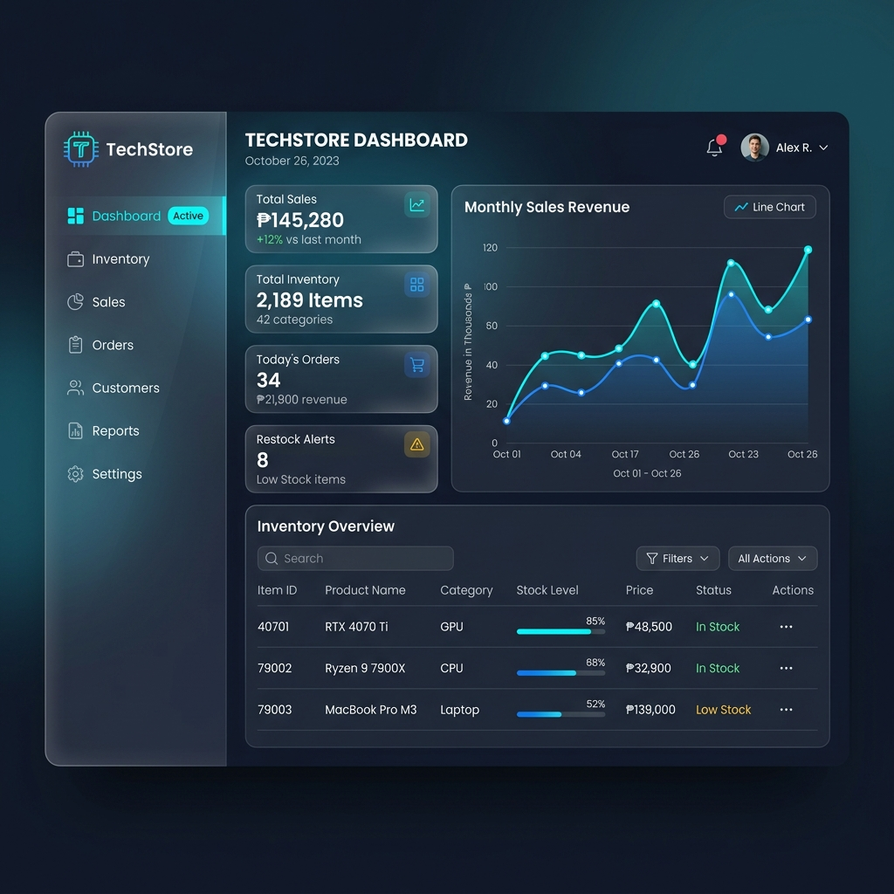
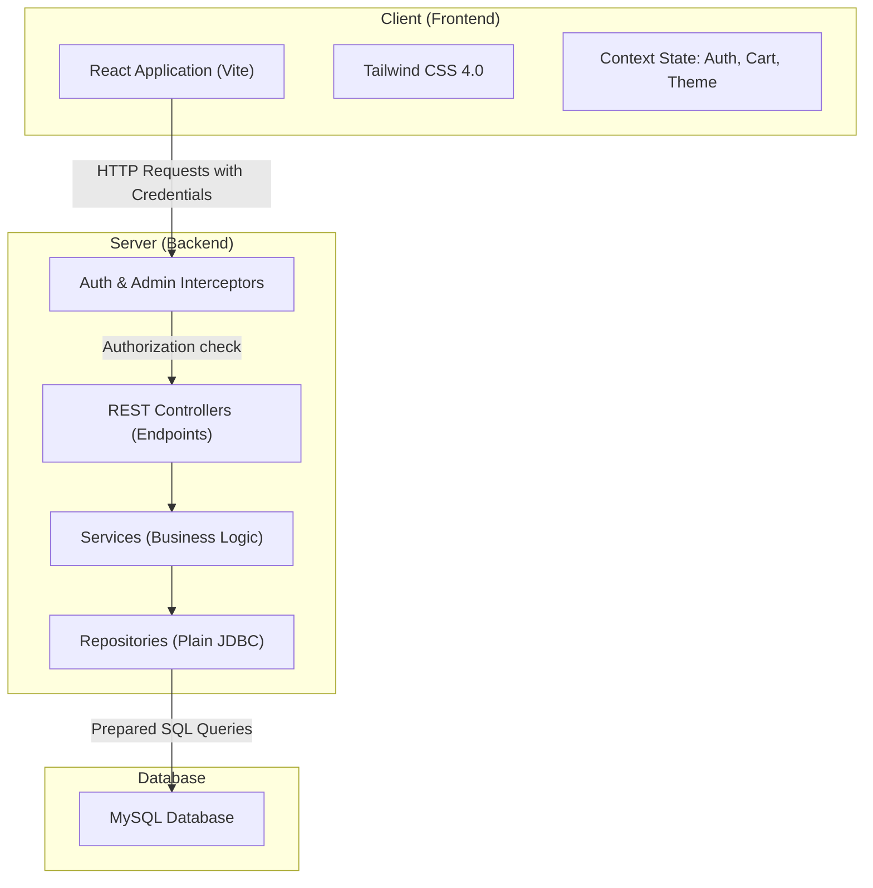
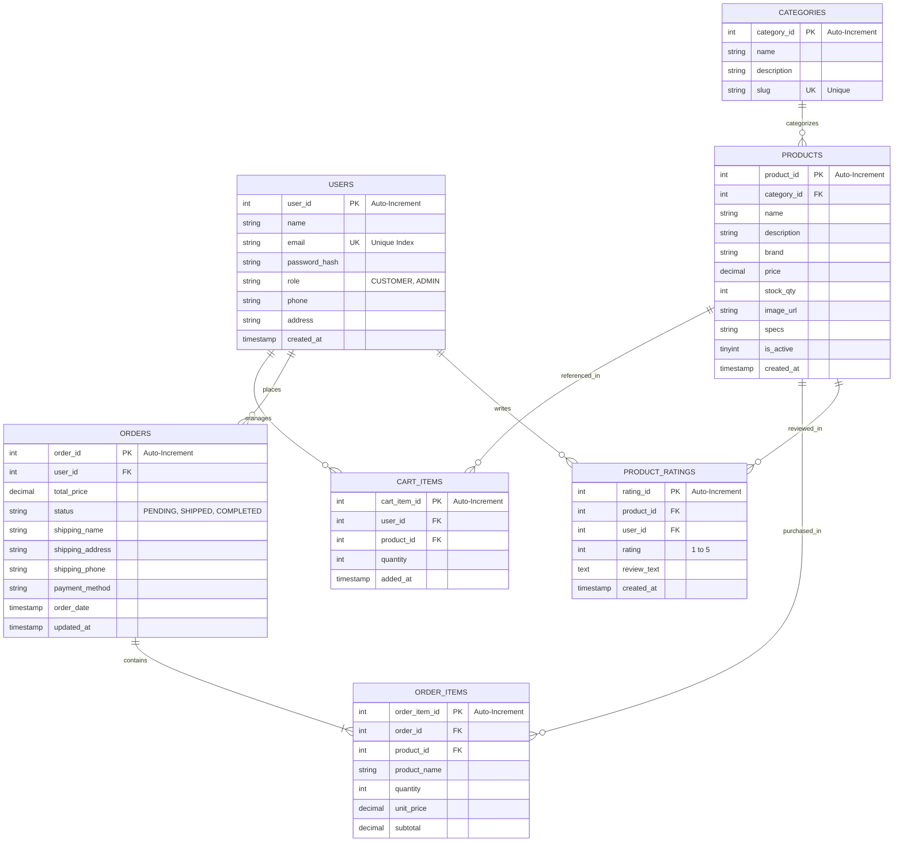

# 💻 TechStore — Inventory & Sales Management System

[](https://spring.io/projects/spring-boot)
[](https://openjdk.org/)
[](https://react.dev/)
[](https://tailwindcss.com/)
[](https://www.mysql.com/)

> A lightweight, modern, and high-performance e-commerce platform and inventory system tailored for computer shops. Features custom security interceptors, a responsive React frontend, and a high-speed JDBC-based database layer.

---

## 🖼️ Application Interface



---

## 📖 Table of Contents

1. [Key Features](#-key-features)
2. [System Architecture](#-system-architecture)
3. [Technology Stack](#-technology-stack)
4. [Database Schema (ERD)](#-database-schema-erd)
5. [Project Directory Layout](#-project-directory-layout)
6. [Getting Started (Installation)](#-getting-started-installation)
7. [API Endpoints Reference](#-api-endpoints-reference)
8. [License](#-license)

---

## ✨ Key Features

### 🛍️ Customer Experience
- **Interactive Shop Catalog**: Filter components by category, search by keywords, and sort by price.
- **Detailed Spec Sheets**: Read in-depth product technical specifications.
- **Dynamic Shopping Cart**: Manage selected parts with live recalculation and checkout processing.
- **Secure Checkout**: Streamlined delivery detail updates and multi-method payments.
- **Ratings & Reviews**: Submit 1–5 star ratings and reviews to product pages.

### 🛡️ Administrator Control Panel
- **Analytics Dashboard**: Live overview tracking total sales, registered users, and active inventory count.
- **Category CRUD**: Quick management of product groups and slugs.
- **Product & Stock Controller**: Modify product properties, set pricing, adjust inventory, and upload files.
- **Order Dispatch**: Process order transitions (e.g., PENDING → SHIPPED → COMPLETED).

### ⚙️ Under-the-Hood Highlights
- **Session-Based Cookie Security**: Secure `JSESSIONID` cookies with `http-only` and `same-site=lax` protection.
- **BCrypt Password Hashing**: Hashed data storage for privacy and security.
- **Raw JDBC Repositories**: High-performance, explicit database operations using raw SQL prepared statements (no ORM overhead).

---

## 🏗️ System Architecture

TechStore segregates logic cleanly between client and server layers. The system relies on custom intercepts rather than Spring Security to minimize footprint and maintain fine-grained routing.



---

## 🛠️ Technology Stack

| Layer | Component | Technology / Version | Purpose |
| :--- | :--- | :--- | :--- |
| **Backend** | Framework | Spring Boot v3.2.4 | REST Core API framework |
| | Runtime | Java JDK 17 | Core language backend |
| | Connection Pool| HikariCP (Starter JDBC) | Database pool management |
| | Hashing | jBCrypt v0.4 | Secure credential hashing |
| **Frontend**| Library | React v19.0 | Client interface rendering |
| | Bundler | Vite v8.0 | High-speed compilation & dev environment |
| | Styling | Tailwind CSS v4.3.0 | Modern utility design framework |
| | Icons | Lucide React | Clean, scalable vector icon pack |
| **Database**| RDBMS | MySQL v8.0+ | Relational storage schema |

---

## 🗄️ Database Schema (ERD)

The database schema is initialized automatically using the resources script [schema.sql](src/main/resources/schema.sql).



---

## 📂 Project Directory Layout

```text
techstore/
├── src/main/java/com/techstore/
│   ├── config/             # CORS and interceptor configurations
│   ├── controller/         # REST API Controllers (endpoints)
│   ├── dto/                # Data Transfer Objects
│   ├── exception/          # Global Exception Handler
│   ├── interceptor/        # Auth & Admin Handler Interceptors
│   ├── model/              # Entity POJOs
│   ├── repository/         # JDBC raw SQL query files
│   ├── service/            # Core business & transactional logic
│   └── util/               # Security, validation, and session helpers
├── src/main/resources/
│   ├── application.properties # Server database config
│   └── schema.sql          # DB setup SQL script
├── frontend/
│   ├── src/
│   │   ├── components/     # Navbar, Footer, Route Guards, Ratings
│   │   ├── context/        # Auth, Cart, and Theme Context providers
│   │   ├── pages/          # Home, Shop, Details, Profiles, and Admin Views
│   │   └── services/       # Fetch API wrapper (api.js)
│   ├── package.json        # Frontend configuration & scripts
│   └── tailwind.config.js  # Style options
└── pom.xml                 # Maven dependency descriptor
```

---

## 🚀 Getting Started (Installation)

### Prerequisites
- **Java SE Development Kit (JDK 17)**
- **Node.js (v18 or higher)**
- **MySQL Server (v8.0+)**
- **Maven build manager**

### Step 1: Database Initialization
1. Create a MySQL database instance:
   ```sql
   CREATE DATABASE techstore_db;
   ```
2. Import the [schema.sql](src/main/resources/schema.sql) file structure.
3. Open [application.properties](src/main/resources/application.properties) and update your credentials:
   ```properties
   spring.datasource.url=jdbc:mysql://localhost:3306/techstore_db?useSSL=false&serverTimezone=UTC&allowPublicKeyRetrieval=true
   spring.datasource.username=YOUR_MYSQL_USERNAME
   spring.datasource.password=YOUR_MYSQL_PASSWORD
   ```

### Step 2: Running the REST Backend
From the root workspace folder, trigger the Spring Boot target:
```powershell
mvn spring-boot:run
```
The server boot logs will display on port `8080` with mapping path `/techstore_db`.

### Step 3: Running the Frontend
1. Change directory to frontend:
   ```powershell
   cd frontend
   ```
2. Install npm components:
   ```powershell
   npm install
   ```
3. Start the Vite React server:
   ```powershell
   npm run dev
   ```
The frontend page will boot locally at `http://localhost:5173`.

---

## 🔌 API Endpoints Reference

### 🔐 Authentication
*   `POST /register` — Submit account signup registry.
*   `POST /login` — Authenticate details and start user session.
*   `POST /logout` — Clear active user session.
*   `GET /session` — Fetch active session metrics.

### 📦 Customer Catalog
*   `GET /products` — Query catalog listings (optional filter query parameters: `id`, `categoryId`, `search`).
*   `GET /categories` — Obtain all available hardware departments.
*   `GET /products/{id}/ratings` — Fetch review listings matching a product ID.

### 🛒 Checkout Flow (Session Protected)
*   `GET /cart` — View user shopping cart items.
*   `POST /cart` — Add product item line.
*   `PUT /cart` — Set new quantity metric.
*   `DELETE /cart?productId={id}` — Remove component item.
*   `POST /orders` — Execute purchase validation and compile order.
*   `GET /orders` — Query personal historical orders.

### 👑 Administrative Operations (Admin Intercept Protected)
*   `GET /admin/dashboard` — View system state summary stats.
*   `POST /admin/products` — Add inventory listing.
*   `POST /admin/products/upload` — Multipart post endpoint for file graphics uploading.
*   `PUT /admin/orders?orderId={id}&status={status}` — Progress status of customer order.

---

Developer: Muhammad Hussnain
